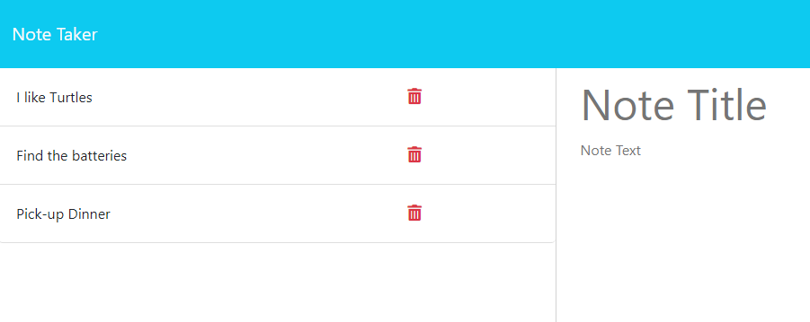

# Note Taker
This is a repo to host a note taking application. 
This app will allow the user to create and save notes.
User can view and delete any of their past notes they have created.
### Deployed
App is deployed [here](https://note-taker-lg-a0a913a2814d.herokuapp.com/)

## Install/Local Usage
This application requires [Node](https://nodejs.org) to be installed.
Clone the repo, then run 'npm i' inside the directory with the package.json file.
To deploy app locally,
run 'node server' to start the server which should then be deployed at [localhost:3001](http://localhost:3000).

## Screenshots

## Credits
This app runs as a [Node](https://nodejs.org) server using [Express](https://www.npmjs.com/package/express)
App is deployed to [Heroku](heroku.com)
